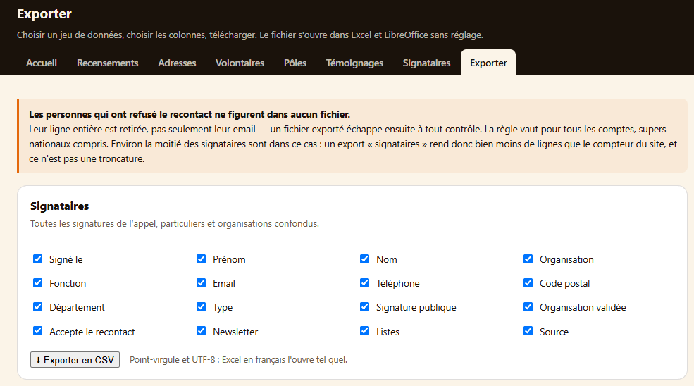
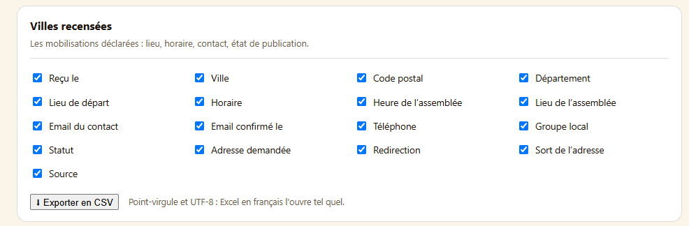
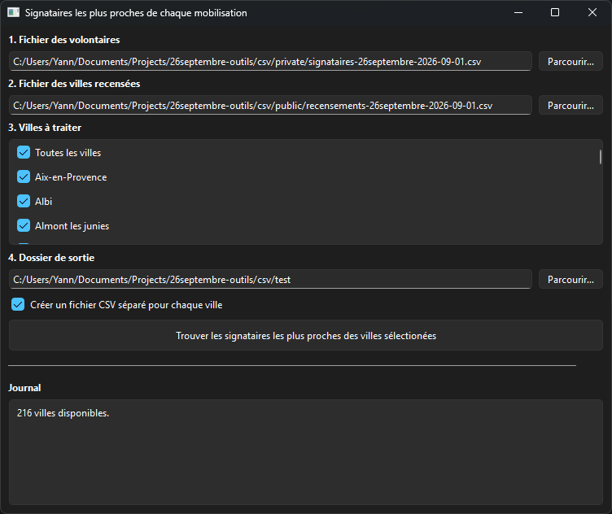

# 26septembre-outils
Outils pour l'organisation de la marche pour le climat du 26 septembre 2026 (26septembre.org)

## Signataires les plus proches de chaque mobilisation
Cet outil permet de lister les signataires les plus proches de chaque ville avec une mobilisation.
- On lui donne à lire des fichiers CSV exportés du site [26septembre.org](https://26septembre.org/admin/export)
- Il génère en sortie un fichier avec la liste des signataires, avec pour chacun la ville avec une mobilisation la plus proche de chez lui, avec la distance en kilomètres

Il est possible de générer un fichier global pour l'ensemble des villes sélectionnées, ou un fichier pour chacune des villes sélectionnées.

### Exporter les fichiers CSV
Sur la page des exports du site [26septembre.org](https://26septembre.org/admin/export) (accessible uniquement en tant qu''administrateur), télécharger le fichier des signataires et des villes recensées, en cochant bien toutes les cases.

 

### Télécharger l'outil
Télécharger la dernière version du fichier `signataires_villes_proches.exe` dans les [releases](https://github.com/FunkyKwak/26septembre-outils/releases).

### Lancer le programme
> [!WARNING]
> La première fois seulement : Ignorer l'alerte de Windows Defender (je n'ai pas payé de certificat, environ 300€/an) : Cliquer sur "Exécuter quand même".

1. Renseigner les 2 fichiers précédemment exportés dans les champs correspondants (via glisser-déposer ou le bouton "Parcourir")
2. Sélectionner une ou plusieurs villes selon le besoin
3. Choisir un dossier de sortiie, dans lequel seront générés les fichiers
3. Cocher la case "Créer un fichier CSV séparé pour chaque ville" si besoin, poour par exemple pouvoir envoyer les fichiers séparéments à l''organisation de la marche dans chaque ville 
4. Cliquer sur "Trouver les signataires les plus proches des villes sélectionées"

> [!TIP]
> Le(s) fichier(s) CSV de sortie sont généré(s) dans le dossier précédemment sélectionné. Vous pouvez maintenant les consulter, en les important dans un tableur pour filtrer par exemple selon la ville ou le nombre de kilomètres quii sépare chaque signataire de la mobilisation la plus proche.
